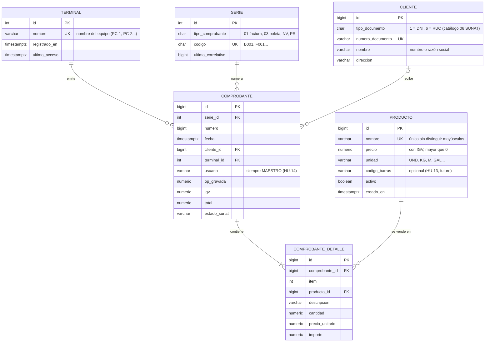

# Modelo de datos (T-01)

Base de datos central PostgreSQL 16 en la PC principal. Todas las terminales
leen y escriben sobre ella; por eso los correlativos se generan en la base de
datos y no en cada PC (HU-16).

## Diagrama entidad-relación

## Decisiones

| Decisión | Motivo |
|---|---|
| Los precios se guardan **con IGV incluido**. | Es como la ferretería fija y anuncia sus precios; la operación gravada y el IGV se calculan al vender. |
| Sin columnas de stock en `producto`. | HU-01 lo excluye expresamente (sin control de inventario). |
| `serie.ultimo_correlativo` se incrementa con `UPDATE ... RETURNING`. | La fila queda bloqueada hasta el fin de la transacción: dos terminales no pueden obtener el mismo número (T-05). |
| `(serie_id, numero)` es único en `comprobante`. | Segunda barrera contra correlativos repetidos. |
| `comprobante_detalle.descripcion` y `precio_unitario` se copian del producto. | Si el producto cambia de precio, el comprobante emitido no cambia. |
| `terminal` guarda el nombre del equipo. | Cada documento registra desde qué PC se emitió (criterio de HU-14). |
| `usuario` es texto fijo `MAESTRO`. | Perfil único sin credenciales (RF-14). |

Las clases de `src/Condor.Dominio` reflejan estas tablas. Las sentencias SQL
están en `db/migraciones` (T-03).
