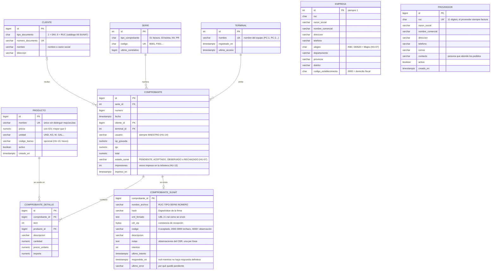

# Modelo de datos (T-01)

Base de datos central PostgreSQL 16 en la PC principal. Todas las terminales
leen y escriben sobre ella; por eso los correlativos se generan en la base de
datos y no en cada PC (HU-16).

## Diagrama entidad-relación


```mermaid
erDiagram
    TERMINAL ||--o{ COMPROBANTE : "emite"
    SERIE ||--o{ COMPROBANTE : "numera"
    CLIENTE |o--o{ COMPROBANTE : "recibe"
    COMPROBANTE ||--|{ COMPROBANTE_DETALLE : "contiene"
    COMPROBANTE ||--o| COMPROBANTE_SUNAT : "se envía"
    PRODUCTO ||--o{ COMPROBANTE_DETALLE : "se vende en"

    TERMINAL {
        int id PK
        varchar nombre UK "nombre del equipo (PC-1, PC-2...)"
        timestamptz registrado_en
        timestamptz ultimo_acceso
    }
    PRODUCTO {
        bigint id PK
        varchar nombre UK "único sin distinguir mayúsculas"
        numeric precio "con IGV, mayor que 0"
        varchar unidad "UND, KG, M, GAL..."
        varchar codigo_barras "opcional (HU-13, futuro)"
        boolean activo
        timestamptz creado_en
    }
    CLIENTE {
        bigint id PK
        char tipo_documento "1 = DNI, 6 = RUC (catálogo 06 SUNAT)"
        varchar numero_documento UK
        varchar nombre "nombre o razón social"
        varchar direccion
    }
    SERIE {
        int id PK
        char tipo_comprobante "01 factura, 03 boleta, NV, PR"
        char codigo UK "B001, F001..."
        bigint ultimo_correlativo
    }
    COMPROBANTE {
        bigint id PK
        int serie_id FK
        bigint numero
        timestamptz fecha
        bigint cliente_id FK
        int terminal_id FK
        varchar usuario "siempre MAESTRO (HU-14)"
        numeric op_gravada
        numeric igv
        numeric total
        varchar estado_sunat "PENDIENTE, ACEPTADO, OBSERVADO o RECHAZADO (HU-07)"
        int impresiones "veces impreso en la ticketera (HU-12)"
        timestamptz impreso_en
    }
    COMPROBANTE_DETALLE {
        bigint id PK
        bigint comprobante_id FK
        int item
        bigint producto_id FK
        varchar descripcion
        numeric cantidad
        numeric precio_unitario
        numeric importe
    }
    EMPRESA {
        int id PK "siempre 1"
        char ruc
        varchar razon_social
        varchar nombre_comercial
        varchar direccion
        varchar telefono
        char ubigeo "INEI, 040520 = Majes (HU-07)"
        varchar departamento
        varchar provincia
        varchar distrito
        char codigo_establecimiento "0000 = domicilio fiscal"
    }
    COMPROBANTE_SUNAT {
        bigint comprobante_id PK
        varchar nombre_archivo "RUC-TIPO-SERIE-NÚMERO"
        varchar hash "DigestValue de la firma"
        text xml_firmado "UBL 2.1 tal como se envió"
        bytea cdr_zip "constancia de recepción"
        varchar codigo "0 aceptado, 2000-3999 rechazo, 4000+ observación"
        varchar descripcion
        text notas "observaciones del CDR, una por línea"
        int intentos
        timestamptz ultimo_intento
        timestamptz respondido_en "null mientras no haya respuesta definitiva"
        varchar ultimo_error "por qué quedó pendiente"
    }
    PROVEEDOR {
        bigint id PK
        char ruc UK "11 dígitos, el proveedor siempre factura"
        varchar razon_social
        varchar nombre_comercial
        varchar direccion
        varchar telefono
        varchar correo
        varchar contacto "persona que atiende los pedidos"
        boolean activo
        timestamptz creado_en
    }
```

`EMPRESA` no se relaciona con las demás tablas: guarda los datos de la
ferretería que se imprimen en la cabecera de cada ticket (migración V005).
`PROVEEDOR` (migración V006, HU-04) aún no se relaciona con las demás: las
compras a proveedores (HU-11) se asociarán a ella.

## Decisiones

| Decisión | Motivo |
|---|---|
| Los precios se guardan **con IGV incluido**. | Es como la ferretería fija y anuncia sus precios; la operación gravada y el IGV se calculan al vender. |
| Sin columnas de stock en `producto`. | HU-01 lo excluye expresamente (sin control de inventario). |
| `serie.ultimo_correlativo` se incrementa con `UPDATE ... RETURNING`. | La fila queda bloqueada hasta el fin de la transacción: dos terminales no pueden obtener el mismo número (T-05). |
| `(serie_id, numero)` es único en `comprobante`. | Segunda barrera contra correlativos repetidos. |
| `comprobante_detalle.descripcion` y `precio_unitario` se copian del producto. | Si el producto cambia de precio, el comprobante emitido no cambia. |
| `terminal` guarda el nombre del equipo. | Cada documento registra desde qué PC se emitió (criterio de HU-14). |
| `usuario` es texto fijo `MAESTRO`. | Perfil único sin credenciales (RF-14). |
| `cliente` es único por `(tipo_documento, numero_documento)`. | Un DNI o RUC se registra una sola vez aunque dos PC lo intenten a la vez (HU-03). |
| `comprobante` exige `op_gravada + igv = total`. | Un error de cálculo no puede llegar a un comprobante emitido (HU-05). |
| `comprobante.impresiones` empieza en 0. | Si la ticketera falla, el comprobante queda registrado y se sabe que falta imprimirlo (HU-12). |
| `proveedor` es único por `ruc` y lo exige con su prefijo (10, 15, 16, 17 o 20). | El proveedor emite facturas, así que siempre tiene RUC; dos PC no pueden registrarlo dos veces (HU-04). |
| El XML firmado y el CDR se guardan en `comprobante_sunat`, aparte de `comprobante`. | Pesan varios KB: el historial y la emisión no los leen; se conservan para auditoría (HU-07). |
| Un estado SUNAT definitivo (aceptado, observado o rechazado) ya no cambia. | Si dos PC reenvían el mismo comprobante, la segunda respuesta no pisa la primera (V007). |
| Índice parcial de comprobantes `PENDIENTE`. | El reenvío automático (HU-17) los encuentra rápido entre miles de aceptados. |
| `empresa` tiene una sola fila (`id = 1`). | Las tres PC imprimen la misma cabecera; se corrige con un `UPDATE`, sin recompilar. |

## Datos de la empresa

La migración V005 deja valores provisionales. Antes del piloto se reemplazan
por los de la ficha RUC del local, desde `psql` en la PC principal:

```sql
UPDATE empresa
SET ruc = '20XXXXXXXXX', razon_social = '...', direccion = '...', telefono = '...'
WHERE id = 1;
```

La migración V007 agrega el domicilio fiscal que va en el XML de la SUNAT
(ubigeo 040520, Majes, Caylloma, Arequipa, establecimiento 0000). Si la ficha
RUC dice otra cosa:

```sql
UPDATE empresa
SET ubigeo = '040520', departamento = 'AREQUIPA', provincia = 'CAYLLOMA',
    distrito = 'MAJES', codigo_establecimiento = '0000'
WHERE id = 1;
```

Las clases de `src/Condor.Dominio` reflejan estas tablas. Las sentencias SQL
están en `db/migraciones` (T-03).
